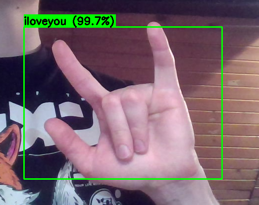

# hand-sign-recognition
University project for Deep Learning, the goal is to use computer vision to recognize hand signs in ASL

## Navigation:
- The `detect_hands.ipynb` contains logic used to train a regression model in order to detect the coordinates of the hands on the pictore.

- The `with_detect_hands.ipynb` contains logic to train a CNN model in order to classify the picture cropped by the previous model, as one of the given ASL gestures.

- In the `app/` folder resides the logic using the trained models, in order to classify the users ASL gestures in real time, using the video feed of their webcam.

## Usage
Call:
```
python3 /app/main.py
```
if you have the necessary modules installed (`tensorflow`, `opencv-python`, `numpy`), the app will launch and perform real-time inference using the trained models on the feed of your webcam.

